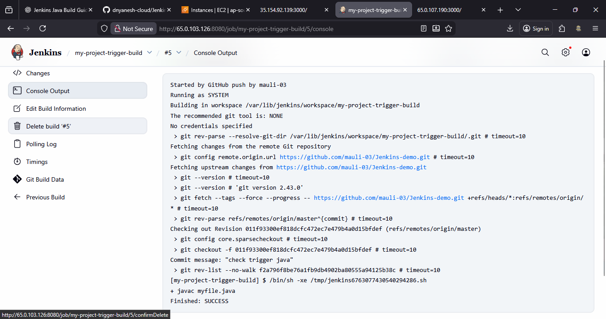

# Java Build Project (Freestyle)
 How to create a simple **Java build project** in Jenkins using a **Freestyle job** and trigger it automatically using a **GitHub webhook**.

---

## Prerequisites
* Jenkins installed and running on Ubuntu/Linux
* Java (JDK) installed on Jenkins server
* Git installed on Jenkins server
* GitHub repository containing a Java file (example: `myfile.java`)
* Jenkins server publicly reachable (for GitHub webhook)

---

## Step 1: Login to Jenkins Dashboard
1. Open browser
2. Go to:
   ```
   http://<jenkins-ip>:8080
   ```
3. Login using Jenkins credentials
---

## Step 2: Create a New Jenkins Job
1. Click **New Item**
2. Enter project name:
   ```
   myjava-build
   ```
3. Select **Freestyle project**
4. Click **OK**
---

## Step 3: Configure Job Settings
### 3.1 General Configuration
* Add **Description** (example):
  > Java build project triggered using GitHub Webhook
---

### 3.2 Source Code Management (SCM)

1. Select **Git**
2. Enter **Repository URL**:
   ```
   https://github.com/<username>/<repository-name>.git
   ```
3. Add credentials if repository is private
---

### 3.3 Build Triggers
  ```
  GitHub hook trigger for GITScm polling
  ```
This allows Jenkins to start the build automatically when GitHub sends a webhook event.
---

### 3.4 Build Step (Execute Shell)
Add **Execute Shell** build step and enter:

```bash
javac myfile.java
java myfile
```
> Make sure `myfile.java` exists in the repository root.
---

### 3.5 Save Configuration
* Click **Save**
---

## Step 4: Configure GitHub Webhook
1. Go to **GitHub Repository**
2. Click **Settings**
3. Select **Webhooks**
4. Click **Add webhook**

### Webhook Details
* **Payload URL**:
  ```
  http://<jenkins-ip>:8080/github-webhook/
  ```
* **Content type**: `application/json`
* **Which events**: Just the **push event**
* Click **Add webhook**
---

## Step 5: Test Webhook Trigger

1. Make a change in `myfile.java`
2. Commit changes:
   ```bash
   git commit -m "Java code updated"
   ```
3. Push to GitHub:
   ```bash
   git push origin main
   ```
4. Check Jenkins dashboard → Build should trigger automatically
---

## Step 6: Build Verification
1. Open Jenkins job
2. Click **Build History**
3. Select latest build
4. Check **Console Output**

You should see:
* Java compilation success
* Java program output
---

## Important Note: Jenkins User & Sudo Privileges
By default, Jenkins runs as a **non-root application user**.
### Check Jenkins User

```bash
cat /etc/passwd | grep jenkins
```

---

### Add Jenkins User to Sudo Group
```bash
sudo usermod -aG sudo jenkins
```

Restart Jenkins after this:
```bash
sudo systemctl restart jenkins
```

---

### Configure Passwordless Sudo (Optional)
Edit sudoers file:

```bash
sudo nano /etc/sudoers
```

Add the following line:
```bash
%sudo ALL=(ALL:ALL) NOPASSWD:ALL
```
> ⚠️ Use this carefully. It grants sudo access without password.
---

## Final Flow Summary

1. Developer pushes Java code to GitHub
2. GitHub webhook notifies Jenkins
3. Jenkins pulls latest code
4. Jenkins compiles and runs Java file
5. Build result displayed in Jenkins

---

